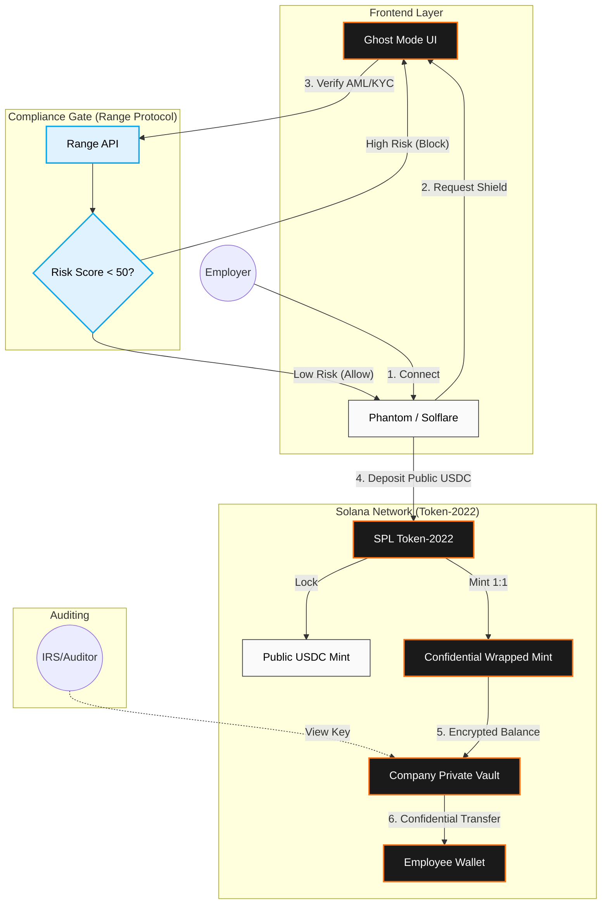

# 🦅 JetrPay (Solana Privacy)


**The first compliance-aware privacy layer for real-time payroll on Solana.**

JetrPay allows businesses to stream salaries and make batched payments confidentially using **Token-2022**, while maintaining regulatory compliance through **Range Protocol** risk scoring and View Key auditing.

> **🏆 Built for the Solana Privacy Hackathon 2026**
> *   **Track**: Private Payments
> *   **Integrations**: Range Protocol, Helius, Token-2022, Radr Labs (ShadowWire)


---

## 🏗️ Technical Architecture

JetrPay bridges the gap between **on-chain privacy** and **real-world compliance**. We utilize a "Gatekeeper" architecture where funds can only enter the hidden state (Confidential Token) after passing a Risk Score check.



---

## ⚡ Key Features

### 1. 👁️ Ghost Mode
A one-click privacy toggle in the UI (Global Header). When active, it:
*   Blurs all balance amounts.
*   Switches the dashboard to a "Stealth" color palette.
*   Prevents shoulder-surfing in public workspaces (co-working, cafes).

### 2. 🛡️ Compliance-First Shielding
We solve the "Tornado Cash" problem. JetrPay is **not** a mixer for illicit funds.
*   **Range Protocol Integration**: Before any wallet can mint the private token, its history is screened against AML/Sanctions lists.
*   **Gatekeeper Logic**: High-risk scores trigger a UI block, preventing the transaction from being constructed.

### 3. 🔒 Token-2022 Confidential Transfers
We leverage the native Solana standard, not a custom quirky smart contract.
*   **Encryption**: Uses ElGamal encryption for balances.
*   **Performance**: Indexed via **Helius RPC** for low latency.
*   **Future Proof**: Standard SPL tokens mean wallet compatibility.

---

## 🚀 Quick Start

### Prerequisites
*   Node.js 18+
*   pnpm
*   Solana CLI (optional)

### Installation

1.  **Clone & Install**
    ```bash
    git clone git@github.com:Ayomisco/jetrpay-solana.git
    cd jetrpay-solana
    
    # Install Frontend
    cd frontend
    pnpm install
    ```

2.  **Environment Setup**
    Create `.env.local` in `frontend/`:
    ```env
    NEXT_PUBLIC_SOLANA_NETWORK=devnet
    NEXT_PUBLIC_HELIUS_RPC_URL=https://devnet.helius-rpc.com/?api-key=YOUR_KEY
    NEXT_PUBLIC_RANGE_API_KEY=YOUR_RANGE_KEY
    ```

3.  **Run Development Server**
    ```bash
    pnpm dev
    ```

---

## 📂 Repository Structure

| Path | Description |
| :--- | :--- |
| `frontend/` | Next.js 14 App Router application. |
| `frontend/lib/solana/` | Core logic for Token-2022 interactions. |
| `frontend/components/privacy/` | Ghost Mode UI components. |
| `contracts/` | Anchor workspace for custom logic (if needed). |
| `contracts/scripts/` | TypeScript scripts to setup Mints and test transfers. |

## 🛠️ Technology Stack

*   **Frontend**: Next.js 14, Tailwind CSS, Shadcn/UI
*   **Blockchain**: Solana (Devnet)
*   **Token Standard**: SPL Token-2022 (Extensions: ConfidentialTransfer)
*   **RPC Provider**: **Helius** (Required for indexing confidential transfers)
*   **Compliance**: **Range Protocol** (Wallet Risk Screening)
*   **Wallet**: Solana Wallet Adapter (Phantom, Solflare)

## 📄 License

Distributed under the MIT License.
