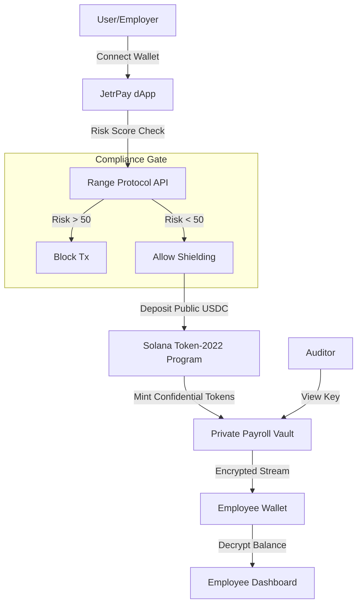

# 🦅 JetrPay (Solana Privacy)


**The first compliance-aware privacy layer for real-time payroll on Solana.**

JetrPay allows businesses to stream salaries and make batched payments confidentially using **Token-2022**, while maintaining regulatory compliance through **Range Protocol** risk scoring and View Key auditing.

> **🏆 Built for the Solana Privacy Hackathon 2026**
> *   **Track**: Private Payments
> *   **Integrations**: Range Protocol, Helius, Token-2022


## ⚡ Key Features

*   **👁️ Ghost Mode**: One-click UI toggle that blurs sensitive financial data for privacy in public spaces.
*   **🛡️ Compliance-First Shielding**: Before assets are "Shielded" (converted to Confidential Tokens), the wallet is screened via **Range Protocol** to prevent illicit funds from entering the anonymity set.
*   **🔒 Token-2022 Confidential Transfers**: Uses native SPL Confidential Transfer extensions to encrypt balances and transaction amounts on-chain.
*   **⚡ Real-Time Streaming**: (Roadmap) Pay employees by the second, privately.

## 🏗️ Architecture



## 🚀 Quick Start

### Prerequisites
*   Node.js 18+
*   pnpm
*   Solana CLI (optional, for local validator)

### Installation

1.  **Clone the repo**
    ```bash
    git clone git@github.com:Ayomisco/jetrpay-solana.git
    cd jetrpay-solana
    ```

2.  **Install Frontend Dependencies**
    ```bash
    cd frontend
    pnpm install
    ```

3.  **Configure Environment**
    Copy `.env.example` to `.env.local` and add your keys (Helius RPC, Range API).
    ```bash
    cp .env.example .env.local
    ```

4.  **Run Development Server**
    ```bash
    pnpm dev
    ```
    Visit `http://localhost:3000` to access the "Ghost Mode" dashboard.

## 📂 Repository Structure

```text
jetrpay-solana/
├── frontend/           # Next.js 14 App (The Interface)
│   ├── app/            # App Router Pages
│   ├── components/     # UI Components (Ghost Mode, Wallet)
│   ├── lib/            # Solana & Compliance Logic
│   └── public/         # Static Assets
├── contracts/          # Anchor/Native Programs (Optional Logic)
└── PRODUCTION_ROADMAP.md # Detailed Path to Mainnet
```

## 🛠️ Technology Stack

*   **Frontend**: Next.js 14, Tailwind CSS, Shadcn/UI
*   **Blockchain**: Solana (Devnet)
*   **Token Standard**: SPL Token-2022 (Extensions: ConfidentialTransfer)
*   **RPC Provider**: **Helius** (Required for indexing confidential transfers)
*   **Compliance**: **Range Protocol** (Wallet Risk Screening)
*   **Wallet**: Solana Wallet Adapter (Phantom, Solflare)

## 🤝 Contributing

1.  Fork the Project
2.  Create your Feature Branch (`git checkout -b feature/AmazingFeature`)
3.  Commit your Changes (`git commit -m 'Add some AmazingFeature'`)
4.  Push to the Branch (`git push origin feature/AmazingFeature`)
5.  Open a Pull Request

## 📄 License

Distributed under the MIT License. See `LICENSE` for more information.
