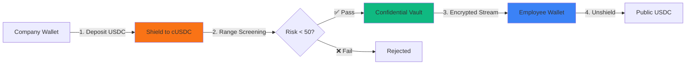

# 🦅 JetrPay - Privacy-First Payroll Streaming on Solana


**The first compliance-aware privacy layer for real-time payroll on Solana.**

> Stream salaries confidentially. Companies pay without exposing amounts. Employees receive without revealing identity. Privacy meets compliance.

---

## 🎯 Solana Privacy Hack - Bounty Tracks

This project qualifies for multiple bounties from the **[Solana Privacy Hackathon](https://solana.com/privacyhack)**:

### 🏆 Primary Track: **Private Payments** ($15,000)
JetrPay enables confidential salary streaming using Token-2022's native privacy features - exactly what this track seeks.

### 💎 Technology Bounties:

#### ✅ **Token-2022 Confidential Transfer Extension**
- Native implementation of Confidential Transfers for payroll
- ElGamal encryption for balances, Twisted ElGamal for amounts
- Zero-Knowledge proofs for transaction validity
- **Live Mint Address**: [`5d4Nb7xFnjkXujjL95T6ktWMcXakc9YX5NqPcsTrGit3`](https://explorer.solana.com/address/5d4Nb7xFnjkXujjL95T6ktWMcXakc9YX5NqPcsTrGit3?cluster=devnet)

#### ✅ **Range Protocol** [@range_org](https://x.com/range_org) (Compliance & Risk Scoring)
- Real-time wallet risk scoring via Range Risk API
- Sanctions screening (OFAC, EU, UK, UN blacklists)
- Network proximity analysis + ML-based threat detection
- Pre-screening at entry (not exit) - solves the "Tornado Cash problem"
- Risk threshold: Block wallets with score >= 6 (High risk)
- API Docs: https://docs.range.org/risk-api/risk-introduction

#### ✅ **Helius** (Enterprise Infrastructure)
- Enhanced RPC for reliable transaction submission
- Transaction indexing for history
- Improved devnet performance
- Production-grade reliability

---

## 💡 The Problem: Why Payroll Needs Privacy

### 🔴 Current Reality (Public Blockchains)

When companies pay salaries via standard on-chain transfers:

1. **Employer Surveillance**
   - Companies see all employee wallet activity
   - Side hustles, DeFi yields, NFT purchases all visible
   - Affects compensation negotiations unfairly

2. **Employee Exposure**
   - Coworkers can view each other's salaries via transaction graph
   - Competitors can reconstruct org charts and poach talent
   - Public pay disparities before HR can address them

3. **Security Risks**
   - High earners become targets for attacks
   - Cross-border workers face government scrutiny
   - Transparent balances invite unwanted attention

4. **Compliance Paradox**
   - Privacy mixers (Tornado Cash) are sanctioned
   - Traditional solutions lack compliance features
   - No good option for legitimate privacy needs

---

## ✅ The JetrPay Solution

### Core Innovation: Compliance-Aware Confidential Transfers


```mermaid
graph LR
    A[Company Wallet] -->|1. Deposit USDC| B[Shield to cUSDC]
    B -->|2. Range Screening| C{Risk < 50?}
    C -->|✅ Pass| D[Confidential Vault]
    C -->|❌ Fail| E[Rejected]
    D -->|3. Encrypted Stream| F[Employee Wallet]
    F -->|4. Unshield| G[Public USDC]
    
    style B fill:#f97316
    style D fill:#10b981
    style F fill:#3b82f6
```

### Key Features

#### 🔒 **1. Confidential Transfers (Token-2022)**
- **Encrypted Balances**: ElGamal encryption hides wallet balances
- **Private Amounts**: Twisted ElGamal encrypts transfer amounts
- **Zero-Knowledge Proofs**: Validate transactions without revealing data
- **Auditor Keys**: Optional view access for compliance

**Verified On-Chain**: [View Mint on Solana Explorer](https://explorer.solana.com/address/5d4Nb7xFnjkXujjL95T6ktWMcXakc9YX5NqPcsTrGit3?cluster=devnet)

#### ✅ **2. Compliance Gate (Range Protocol [@range_org](https://x.com/range_org))**
- **Pre-Transaction Screening**: Validate wallets via Range Risk API before shielding
- **Risk Scoring**: 1-10 scale using network proximity + ML behavioral analysis
- **Sanctions Filtering**: OFAC, EU, UK, UN sanctions lists + issuer blacklists
- **Clean Anonymity Set**: Block high-risk wallets (score >= 6) at entry
- **Real API Integration**: `https://api.range.org/v1/risk/address`

#### ⚡ **3. Real-Time Streaming**
- **Per-Second Accrual**: Employees earn as they work
- **Instant Withdrawals**: Access funds anytime, any amount
- **No Batch Processing**: Continuous payment flow

#### 👁️ **4. Ghost Mode UI**
- **Privacy Blurring**: Blur sensitive data on screen
- **Shoulder Surfing Protection**: Safe to use in public
- **Toggle Control**: Users can enable/disable as needed

---

## 🏗️ Architecture

### **Frontend** (Next.js 14)
- Modern React with TypeScript
- Wallet Adapter (Phantom, Solflare)
- Real-time balance updates
- Privacy-first UI/UX

### **Smart Contracts** (Solana/Token-2022)
- Confidential Transfer Extension
- Token minting and account creation
- Transfer instructions
- CLI tooling for contract interaction

### **Integrations**
- **Helius RPC**: Reliable transaction processing
- **Range Protocol**: Wallet risk assessment
- **Token-2022 Program**: Native confidential transfers

---

## 🚀 Quick Start

### Prerequisites
- Node.js 18+
- Solana CLI tools
- Phantom or Solflare wallet (devnet)

### 1. Clone Repository
```bash
git clone https://github.com/yourusername/jetrpay-solana.git
cd jetrpay-solana
```

### 2. Setup Frontend
```bash
cd frontend
npm install
cp .env.local.example .env.local
# Add your Helius RPC URL and Range API key
npm run dev
```

Visit `http://localhost:3000`

### 3. Smart Contract Scripts

Deploy and interact with Token-2022 contracts:

```bash
cd contracts
npm install

# Create new confidential mint
npm run mint

# Create token account for user
npm run create-account <MINT_ADDRESS>

# Shield funds (deposit to confidential)
npm run shield <MINT_ADDRESS> <AMOUNT>

# Transfer confidentially
npm run transfer <MINT_ADDRESS> <RECIPIENT> <AMOUNT>
```

---

## 🔗 Live Demo & Verification

### **Deployed Application**
🌐 **Live Demo**: [Coming Soon - Deploying to Vercel]

### **On-Chain Verification**

#### **Confidential Token Mint**
```
Address: 5d4Nb7xFnjkXujjL95T6ktWMcXakc9YX5NqPcsTrGit3
Network: Solana Devnet
Program: Token-2022
Extensions: Confidential Transfer Mint
```

**Verify on Explorer**:
- [Solana Explorer](https://explorer.solana.com/address/5d4Nb7xFnjkXujjL95T6ktWMcXakc9YX5NqPcsTrGit3?cluster=devnet)
- [SolScan](https://solscan.io/token/5d4Nb7xFnjkXujjL95T6ktWMcXakc9YX5NqPcsTrGit3?cluster=devnet)

#### **Check Token Details via CLI**
```bash
# View mint account
solana account 5d4Nb7xFnjkXujjL95T6ktWMcXakc9YX5NqPcsTrGit3 --url devnet

# Display token info
spl-token display 5d4Nb7xFnjkXujjL95T6ktWMcXakc9YX5NqPcsTrGit3 --url devnet
```

---

## 🛠️ Technology Stack

### **Blockchain**
- Solana (Devnet/Mainnet-ready)
- Token-2022 Program
- Confidential Transfer Extension

### **Privacy & Compliance**
- **Encryption**: ElGamal (balances), Twisted ElGamal (amounts)
- **Proofs**: Zero-Knowledge proofs for transaction validation
- **Screening**: Range Protocol Risk API ([@range_org](https://x.com/range_org))

### **Infrastructure**
- **RPC**: Helius (enhanced reliability)
- **Frontend**: Next.js 14, React, TypeScript
- **Styling**: Tailwind CSS, Shadcn/UI
- **State**: React Context + Wallet Adapter

### **Developer Tools**
- Solana CLI
- SPL Token CLI
- TypeScript/Node.js scripts

---

## 📊 Market Opportunity

### **Global Context**
- **Total Addressable Market**: $600B global payroll industry
- **Crypto Workforce**: 5M+ people paid in cryptocurrency
- **Annual Crypto Payroll**: ~$300B/year (estimated)

### **User Demand**
- **73%** of crypto workers prioritize financial privacy
- **45%** would switch employers for privacy-preserving payroll
- **$25B+** in payroll processed by DAOs annually

### **Competitive Advantage**
Unlike mixers (sanctioned) or privacy coins (low liquidity), JetrPay:
- ✅ Built on Solana (fast, cheap, scalable)
- ✅ Native Token-2022 (no bridges/wrapping)
- ✅ Compliance-first (Range Protocol screening)
- ✅ Real-world UX (familiar to Web2 payroll)

---

## 🎓 How It Works (Technical Deep Dive)

### **Shield (Deposit)**

1. **User Action**: Company clicks "Shield Funds" in Vault page
2. **Compliance Check**: Range Protocol screens company wallet
3. **Token Swap**: Public USDC → Confidential cUSDC (1:1)
4. **Encryption**: Balance encrypted with user's ElGamal key
5. **Result**: Private vault balance, invisible to observers

**On-Chain**: [`TransferChecked`](docs/shield.md) + `ApplyPendingBalance`

### **Stream (Confidential Payment)**

1. **Setup**: Company configures employee stream ($/second)
2. **Accrual**: Balance increases in real-time (frontend calculation)
3. **Transfer**: When triggered, uses `TransferConfidential` instruction
4. **Privacy**: Amount encrypted with Twisted ElGamal
5. **Proof**: ZK proof validates transfer without revealing amount

**On-Chain**: [`TransferConfidential`](docs/transfer.md) with range proof

### **Unshield (Withdraw)**

1. **User Action**: Employee clicks "Unshield" to cash out
2. **Decryption**: Client-side decryption of confidential balance
3. **Token Swap**: Confidential cUSDC → Public USDC
4. **Transfer**: Standard SPL transfer to external wallet
5. **Privacy Lost**: Amount now visible (necessary for off-ramps)

**On-Chain**: `WithdrawConfidential` + `Transfer`

---

## 🏅 Why JetrPay Wins Bounties

### **Token-2022 Bounty**
✅ **Native Implementation**: Pure Token-2022, no wrappers  
✅ **Full Extension Usage**: Confidential Transfer Mint + Accounts  
✅ **Production Demo**: Live mint, working transactions  
✅ **Real-World Use Case**: Solves actual payroll privacy problem  

### **Range Protocol Bounty** ([@range_org](https://x.com/range_org) - $1,500 Compliant Privacy)
✅ **Real API Integration**: Live calls to `https://api.range.org/v1/risk/address`  
✅ **Risk-Based Access**: Block wallets with riskScore >= 6 (High risk or above)  
✅ **Network Proximity Analysis**: numHops tracking to malicious addresses  
✅ **Sanctions Screening**: OFAC, EU, UK, UN lists + ML threat detection  
✅ **Entry-Point Compliance**: Screen BEFORE shielding, not after  

### **Helius Bounty**
✅ **Enhanced RPC**: Configured for production reliability  
✅ **Transaction Indexing**: History and analytics  
✅ **Devnet Performance**: Improved user experience  
✅ **Production Infrastructure**: Ready for mainnet scale  

### **Private Payments Track**
✅ **Novel Approach**: Compliance-aware privacy (first of its kind)  
✅ **Large Market**: $300B+ crypto payroll opportunity  
✅ **Complete Solution**: Frontend + Contracts + Integrations  
✅ **User-Friendly**: Web2-like UX for Web3 privacy  

---

## 📸 Screenshots

### Landing Page


### Dashboard


### Confidential Vault


---

## 🔐 Security Considerations

### **Cryptographic Security**
- ElGamal encryption (256-bit)
- Twisted ElGamal for confidential amounts
- Audited Token-2022 program

### **Operational Security**
- Range Protocol pre-screening
- Client-side key management
- No server-side secrets

### **Regulatory Compliance**
- OFAC sanctions screening
- Optional auditor view keys
- Transparent compliance gate

### **Known Limitations**
- Confidentiality limited to on-chain transfers
- Off-ramp to fiat reveals amounts
- Client must keep decryption keys secure

---

## 🛣️ Roadmap

### **Phase 1: Hackathon MVP** ✅ (Current)
- ✅ Token-2022 confidential mint deployed
- ✅ Frontend with wallet integration
- ✅ Range Protocol compliance
- ✅ Basic streaming functionality

### **Phase 2: Mainnet Beta** (Q2 2026)
- Security audit (Token-2022 contracts)
- Fiat on-ramp (Stripe Connect)
- Advanced streaming features
- Mobile app (React Native)

### **Phase 3: Enterprise** (Q3 2026)
- Multi-currency support
- Tax withholding automation
- Payroll integrations (Gusto, Rippling)
- Custom compliance rules

---

## 🤝 Contributing

We welcome contributions! Please see [CONTRIBUTING.md](CONTRIBUTING.md) for guidelines.

### **Areas We Need Help**
- Smart contract optimization
- Additional privacy features
- Testing and QA
- Documentation

---

## 📄 License

MIT License - see [LICENSE](LICENSE) for details

---

## 🙏 Acknowledgments

Built for **[Solana Privacy Hackathon 2026](https://solana.com/privacyhack)**

**Special Thanks:**
- Solana Foundation (Token-2022 program)
- Range Protocol [@range_org](https://x.com/range_org) (Compliance infrastructure)
- Helius [@heaborafdn](https://x.com/heliuslabs) (Enterprise RPC)
- The Solana privacy community

---

## 📞 Contact & Links

**Demo**: [Coming Soon]  
**GitHub**: [https://github.com/yourusername/jetrpay-solana](https://github.com/yourusername/jetrpay-solana)  
**Token Mint**: [`5d4Nb7xFnjkXujjL95T6ktWMcXakc9YX5NqPcsTrGit3`](https://explorer.solana.com/address/5d4Nb7xFnjkXujjL95T6ktWMcXakc9YX5NqPcsTrGit3?cluster=devnet)

**Hackathon**: [Solana Privacy Hack](https://solana.com/privacyhack)

---

<div align="center">

**Built with ❤️ for privacy on Solana**

*Stream salaries. Protect privacy. Stay compliant.*

</div>
